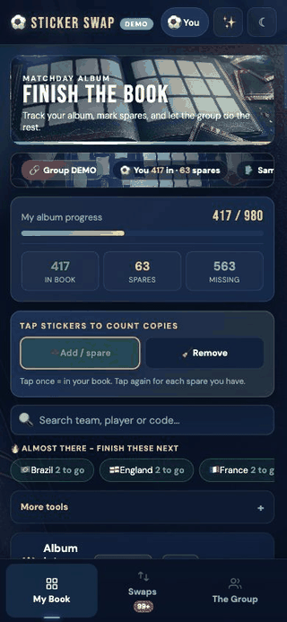

# Sticker Swap



**Create a group. Track your stickers. Find swaps with friends.**

Sticker Swap is a mobile-first web app / PWA for small groups of football sticker
collectors - friends, families, school groups, teams, offices. Everyone tracks
their own album and spares, and the app finds the best trades inside the group.

It is an unofficial fan tool, not affiliated with or endorsed by any sticker
publisher, federation, or tournament.

## Try it in 10 seconds (no setup)

Serve the folder with any static server and open the demo:

```bash
npm run serve        # then visit http://localhost:8000/quick-test.html
```

or open `index.html?demo=1` directly. Demo mode is fully local - no Firebase,
no network writes - and ships with a sample group (You, Sam, Ava, Mo) including
an incoming offer, an outgoing offer, and an accepted swap awaiting your
handover confirmation.

## How the app works

- Single-file static app: `index.html` (no framework, no build step).
- Production identity: Firebase Anonymous Auth; `auth.uid` keys all user data.
  Display names are metadata only.
- Production storage: Firebase Realtime Database under
  `groups/{groupCode}/...` (see `HANDOVER.md` for the exact shape).
- Swap lifecycle: send offer → friend accepts → swap in person → **both** sides
  confirm → books update. Pending offers reserve promised spares.
- PWA: `manifest.webmanifest` + `sw.js` (network-first HTML, cache-first assets).
- If `firebase-config.js` is missing or null, the app shows a friendly
  "App not configured" screen and demo mode keeps working.

## Going live (owner only)

Follow `OWNER-FIREBASE-SETUP.md`: create a fresh Firebase project, enable
Anonymous Auth + Realtime Database, copy the web config into
`firebase-config.js` (shape in `firebase-config.example.js`), deploy
`database.rules.json`, test on two devices, then deploy the folder as a static
site. Never put service-account JSON anywhere in this repo.

## QA

```bash
npm run qa           # all checks
npm run check:pwa    # manifest / service worker / asset references
npm run check:rules  # database rules sanity
npm run check:demo   # demo mode independence from Firebase
```

## Key files

| File | Purpose |
| --- | --- |
| `index.html` | The whole app |
| `quick-test.html` | Demo launcher (redirects to `index.html?demo=1`) |
| `database.rules.json` | Realtime Database rules (UID-keyed, member-gated) |
| `firebase-config.example.js` | Web-config shape for the owner |
| `firebase-config.emulator.js` | Local emulator config |
| `sw.js`, `manifest.webmanifest` | PWA install + offline |
| `scripts/qa-check.js` | Static QA checks |
| `HANDOVER.md`, `OWNER-FIREBASE-SETUP.md`, `QA-CHECKLIST.md` | Owner/developer docs |
